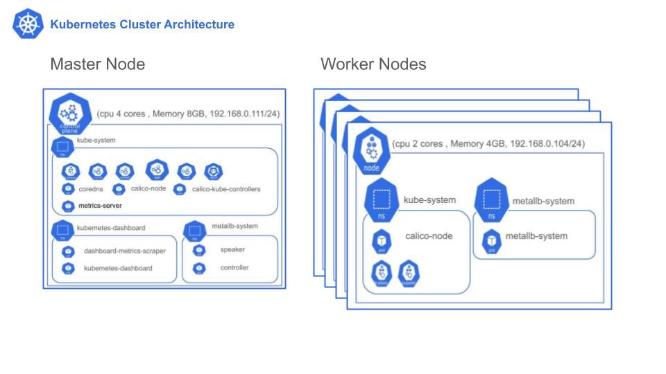

> **[플레이 데이터] 한화시스템 BEYOND SW캠프/ D.P (💥Developer Passion💥)**

 

<h1 align="center">데브옵스 아키텍쳐 구현 👍</h1>

### 🤼‍♂️팀원 소개

  

&nbsp;　&nbsp;　&nbsp;　&nbsp;　&nbsp;　&nbsp;　&nbsp;　&nbsp;　 🐻 **[이동규](https://github.com/PTCman)**&nbsp;　 🦁 **[김태윤](https://github.com/thanks9807)** &nbsp;　 🐶 **[유형도](https://github.com/hyungdoyou)** &nbsp;　 🐯 **[정원준](https://github.com/Wonjunmar)** &nbsp;　 🐺 **[김경미](https://github.com/asasd)**
     

## ✨ 프로젝트 기본 소개

- 온라인 쇼핑몰 이용자 수가 **"지속적으로 증가"** 하고 있는만큼, 쇼핑몰에 등록되는 상품의 수 역시  
  **"기하급수적으로 늘어나"** &nbsp;&nbsp;상품 선택 시 이용자가 **선택의 어려움**을 겪고 있다.

- 따라서 **개인에게 맞는 옷, 스타일을 제공**하여 수많은 상품에 대한 선택의 폭을 줄임으로써  
  **쇼핑시간을 단축** 시켜주는 **"개인 맞춤형 패션 플랫폼 서비스"** 를 제공한다.

 

## 📌 프로젝트 목표
Docker, K8S, Jenkins를 활용하여 기존에 만들었던 Frontend와 Backend프로젝트에 CI/CD를 적용한다.

## :question: CI/CD 필요성

#### 기존 프로젝트 현황
- 팀원끼리 기능을 만든 후 통합하는 과정에서 충돌을 해결하고, 테스트하는 과정이 지속적으로 반복되며, 절차가 까다로움. 
직접 웹페이지로 접속하여, 기능을 테스트하거나, 
포스트맨을 이용해 직접 테스트를 하고 있다. 

  -> 많은 시간 비용이 발생하며, 다양한 케이스를 테스트할 수 없음.
(CI 필요성 대두)

- 개발용 컴퓨터에서 직접 빌드를 하고 배포용 컴퓨터에 배포파일을 옮겨 배포

  -> 새로운 기능을 추가하거나, 에러를 수정할 때마다 배포과정을 반복. (CD 필요성 대두)
  
## :star: CI/CD 기대효과
- CI를 통해 애플리케이션 변경 사항이 자동으로 버그 테스트를 거치고 레포지토리에 업로드 되어 신뢰성 높은 환경을 구성 할 수 있고 항시 배포 가능한 환경이 된다.
- CD는 개발자가 레포지토리에 있는 애플리케이션을 수분내에 지속적으로 배포함으로써 수동으로 배포할 때 보다 시간을 절약 할 수 있다.
 

## 🖥️ 운영 환경 : 쿠버네티스 & 컨테이너 운영 환경 구성 

* 쿠버네티스를 이용한 이유  
 1. 유연성   
  쇼핑몰의 특성상 이벤트와 할인에 따라 트래픽이 몰릴 수 있기 때문에 트래픽 상황에 따라 유연하게 대처할 수 있다는 장점이 있다.

 2. 장애 대처   
  ReplicaSet를 통해, 장애가 생긴 파드를 자동으로 재실행 가능하다.  
 HPA( Horizontal Pod Autoscaler)와 metrics를 활용하여, 파드의 부하 증가에 대처할 수 있다.

### 💡&nbsp;&nbsp;시스템 아키텍처

 

 

* 프론트엔드, 백엔드 각각의 디플로이먼트를 통해 파드로 생성된다.   
* 사용자들은 LB (LoadBalancer) 타입의 Frontend-svc를 통해 웹 포트로 Nginx 서버에 접근하여 서비스를 이용한다.  
* 파드들 간의 통신은 ClusterIp 타입의 서비스를 통해 내부 통신으로 이루어진다. 따라서 외부에 노출 되지 않는다.
* DB는 Statusfulset으로 마스터-슬래이브 구성을 하였다.

### 📁 &nbsp;&nbsp;k8s 클러스터 구성도

 

총 5대의 노드로 클러스터를 구성했다.

 

* CNI는 Calico를 통해서 구성하였으며, 대부분의 경우에 성능적으로 뛰어나다는 점과 오픈 소스라는 점 2가지이다.

* Calico는 LoadBalance type의 서비스를 제공하지 않으므로 metailb를 추가로 사용하게 되었다.  

* metrics는 Hpa를 통한 Autoscaling 구현을 위해 사용한다.
 

<b>Pod 상세 설명</b>
  
   
각 Worker 노드에는 다음과 같은 파드가 공통적으로 생성된다.
 

- calico-node :  네트워크 정책을 관리하고 구성하는 역할 

    

- metalib-system : 클러스터 내에서 로드 밸런싱 및 외부 서비스 노출을 담당하는 역할  

   

### Master Node에는 다음과 같은 파드들이 추가된다.  
> kube-system Namespace
>
> * coredns : 클러스터 내에서 DNS 서버 역할
> * calico-kube-controllers : 클러스터 내에서 네트워크 정책을 관리하고 구성하는 역할
> * metrics-server : 클러스터 내에서 파드 및 노드의 리소스 사용량 및 성능 지표를 수집하고 노출하는 역할

> metailb-system Namespace
>
> * speaker :  외부 라우팅 장치와 통신하여 로드 밸런서에 할당된 IP 주소를 라우팅하는 역할
> * controller : 클러스터 내에서 IP 주소 범위를 관리하고, 외부 서비스에 IP 주소를 동적으로 할당하고 회수하는 역할
 
 

 

### 💽&nbsp;&nbsp;CI/CD 시스템 아키텍처
 

## 📌 기술 스택
&nbsp;&nbsp;&nbsp;&nbsp;</a></a>
&nbsp;&nbsp;&nbsp;&nbsp;</a></a>
&nbsp;&nbsp;&nbsp;&nbsp;</a></a>
&nbsp;&nbsp;&nbsp;&nbsp;</a></a>
&nbsp;&nbsp;&nbsp;&nbsp;</a></a>
 

 

 

## 배포 시나리오

### 블루-그린 방식을 이용한 무중단 배포 

####  이유  
소비자들이 소비 욕구를 느꼈을 때, 그 상품을 바로 구매하지 못하면 구매율이 떨어질 수  밖에 없다.
따라서 쇼핑몰은 사용자들이 원하는 시기에 항상 상품을 구매할 수 있도록 해야한다.
따라서 무중단 배포를 선택하였다. 
방식은 레드 그린 방식을 선택했다.
레드 그린 방식이 이점은 이전 버전의 deployment 가 준비되어있다는 점으로, 최신 버전에 문제가 발생되었을 때,
이전 버전으로 빠르게 되돌릴 수 있다.  

1. develop branch에서 통합이 이루어지면 github action이 Junit를 통해 작성된 테스트 코드를 실행한다.  
2. 깃허브(원격 저장소) main branch 에 최신 버전의 프로젝트가 push된다.
3. 깃허브는 젠킨스에게 Webhook를 보낸다.
4. 젠킨스는 파이프라인에 저장된 절차를 실행한다.  
  a. 젠킨스 서버에 깃허브의 있는 프로젝트를 가져온다. (git clone)  
  b. 프로젝트가 벡엔드라면 mvn package, 프로젝트가 프론트엔드라면 npm run build를 통해 build한다.  
  c. 빌드를 통해 생긴 jar 또는 dist directory를 이용해 dockerfile로 docker image를 만든다.  
  d. docker image를 docker hub에 올린다.  
  e. 젠킨스 서버에서 k8s master에 deployment와 service를 만드는 yml file을 전송한다.  
  f. k8s master에서 yml file들을 적용시킨다. (kubectl apply)  
  g. 파이프라인을 진행하면서 단계마다 시작, 종료, 결과를 젠킨스 서버에서 webhook (젠킨스 webhook 플러그인) 를 통해 slack으로 전송한다.    
  h. slack를 통해 개발자들은 파이프라인 진행 현황을 확인할 수 있다.

5. 블루 그린 방식을 통해 무중단 배포를 한다.
파이프라인의 빌드 번호에 따라 deployment blue또는deployment green이 갱신이 된다.
6. 갱신이 종료된 디플로이먼트를 서비스에 연결 시켜준다.

💻 기능 명세서

 
 

<b>🤵🏻‍♂️ Front </b>
 
    

    	 

         
<b>테스트</b>

                   
         
<b>➡ 판매자가 [ 이메일 아이디, 패스워드, 브랜드명, 브랜드 고유키, 판매자명 ] 을 입력하여 회원가입한다.   
         

         
 
    	 

         
<b>파이프 라인</b>

                   
         
<b>➡ 판매자가 [ 이메일 아이디, 패스워드 ] 를 입력하여 로그인한다.</b>
 
         

         
 
	    

         
<b>무중단 배포</b>

                   
         
<b>➡ 브랜드(판매자)가 [ 브랜드명, 카테고리, 스타일, 상품명, 상품수량, 가격, 상의 및 하의에 대한 치수, 
         &nbsp;&nbsp;&nbsp;&nbsp;&nbsp;상품 이미지 및 상품 설명 이미지 ] 를 입력하여 판매 상품을 등록한다.</b>
 
         

         
 
    

--- -->
